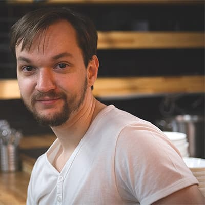
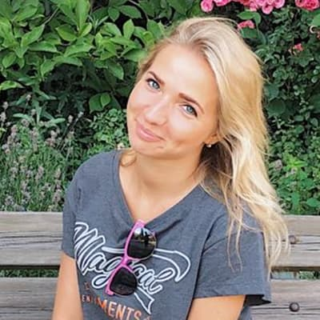

# **Нормы поведения**

Мы ценим участие каждого и хотим дать приятный и насыщенный опыт. Мы ожидаем, что все участники будут проявлять уважение и вежливость по отношению к окружающим на мероприятиях, проводимых командой PiterJS, поэтому в этом документе стараемся разъяснить нормы поведения, как их видим мы.

**Внеси вклад**: этот документ — open source. Ты можешь повлиять на его содержимое, оформив pull request.

**Нормы распростаняются на всех участников**: включая гостей, организаторов, волонтёров, докладчиков и спонсоров, представителей площадки.

**Нормы действуют на следующих площадках PiterJS**:

*   **Оффлайн**: PiterJS meetup, PiterJS conf, PiterJS tour.
*   **Онлайн**: Флудилка PiterJS, группы и каналы в социальных сетях PiterJS, а также [группа на гитхабе](https://github.com/piterjs/), [медиум](http://medium.com/piterjs) и [патреон](https://www.patreon.com/piterjs). Список будет дополняться по мере появления новых типов площадок.

## **Будет хорошо, если ты будешь**

*   **Уважать окружающих**: говорить вежливо, слушать собеседников, критиковать аргументированно.
*   **Обмениваться знаниями**: обсуждать технологии, расширять кругозор.
*   **Беречь имущество площадки**: соблюдать аккуратность и чистоту на территории мероприятия.

## **У нас неприемлемо**

Даже в шутку или на ироничный манер

*   **Переходить на личности**: комментировать пол, гендерную идентичность и самовыражение, сексуальную ориентацию, внешность, телосложение, состояние здоровья, вероисповедание, политические взгляды, увлечения, этническую принадлежность, расу, национальность, возраст, заработок или уровень опыта человека или группы людей.
*   **Проявлять агрессию**: оскорблять, угрожать, унижать, применять физическую силу, причинять вред жизни и здоровью кого угодно.
*   **Проявлять сексуальное внимание**: использовать наготу, сексуальные образы, намёки, ненадлежащие физические контакты, явным образом проявлять несогласованное сексуальное внимание.
*   **Домогаться**: запугивать, шантажировать, преследовать.
*   **Мешать мероприятию**: выкрикивать, перебивать докладчиков или вопрошающих из зала.
*   **Употреблять** алкогольные напитки или наркотические и психотропные вещества. 
*   **Нарушать законы РФ**

## **Я вижу неприемлемое!**

Если ты видишь неприемлемое, то обязательно свяжись с нами, не молчи! Мы не можем решить проблемы, о которых не знаем.

Отличить организаторов можно по чёрным футболкам с жёлтым логотипом PiterJS на груди. Также на их бейджах указано «организатор».

Или подойди к волонтёрам, на бейджиках которых указано «волонтер». Они знают, как найти организаторов.

Кроме возможности найти нас лично, есть варианты удалённой связи:

<table>
  <tr>
   <td>
 
<strong>Андрей Гурылев</strong> 
<a href="https://t.me/fogrew">t.me/fogrew</a> 
<a href="mailto:fogrew@piterjs.dev">fogrew@piterjs.dev</a>
   </td>
   <td> 
<strong>Ксения Копполла</strong> 
<a href="https://t.me/coppolla">t.me/coppolla</a> 
<a href="mailto:coppolla@piterjs.dev">coppolla@piterjs.dev</a>
   </td>
   <td> 
<strong>Анна Волкова</strong> 
<a href="https://t.me/volkova_annie">t.me/volkova_annie</a> 
<a href="mailto:volkova_annie@piterjs.dev">volkova_annie@piterjs.dev</a>
   </td>
  </tr>
</table>

Или напиши на [coc@piterjs.dev](mailto:coc@piterjs.dev). С этой почты сообщения рассылаются на почты группы реагирования норм поведения. Реакция может поступить быстрее, чем в случае обращения лишь к одному человеку.

Если проблема требует скорейшего решения, то в сообщении также стоит описать, где тебя найти на территории площадки и как отличить. Это ускорит приближение нашей встречи.

На наших мероприятиях обычно нет охраны. Однако, в случае возникновения проблем, мы поможем связаться с врачом или местными правоохранительными органами, предложим сопровождение, или иным образом поможем почувствовать себя в безопасности на протяжении всего мероприятия.

## **Что мы сделаем?**

Первым делом мы выясним у оппонентов ситуации и свидетелей мнения о том, что произошло. Это необходимо для составления полной картины.

Затем мы постараемся уладить конфликт мирным путём.

В случае необходимости мы можем попросить нарушителя покинуть мероприятие.

В случае нарушения законов РФ, мы заручимся поддержкой свидетелей и обратимся к местным правоохранительным органам.

